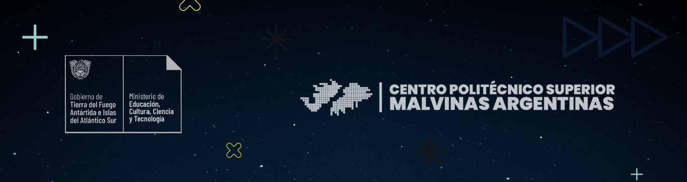

## Tecnicatura Superior en Ciencia de Datos e Inteligencia Artificial
*Aprendizaje Automático
*Autor: Valeria Commatteo

Machine Learning Model: "Prediccion de Produccion de Agua (Ushuaia - Rio Grande)"

## Objetivo del Proyecto: 
Desarrollar un modelo de Aprendizaje Automático que sea capaz de predecir la producción de agua en función de diferentes variables temporales, como el tiempo, y posiblemente otras como el clima y la demanda. La idea es que, a través de esta predicción, podamos anticipar posibles problemas en la producción de agua, lo que nos permitiría identificar con antelación situaciones en las que la producción no sea suficiente para cubrir la demanda. De este
modo, podríamos implementar mejoras operativas o realizar ajustes en el sistema de producción para prevenir estos eventos antes de que afecten a la población o a los recursos de la región. Este modelo será una herramienta valiosa para gestionar el suministro de agua de manera más eficiente, especialmente en un contexto donde la sostenibilidad y la optimización de los recursos hídricos son cada vez más importantes.

## Contexto y Relevancia:
El problema de la producción de agua en Tierra del Fuego es cada vez más relevante debido a la creciente demanda de la población y los efectos del cambio climático en las fuentes hídricas naturales. Factores como el derretimiento de nieve y glaciares tras el invierno, así como las variaciones en las precipitaciones a lo largo del año, afectan tanto la disponibilidad como la calidad del agua. Estas fluctuaciones pueden poner en riesgo el suministro continuo de agua, esencial para la población y las actividades económicas de la región. Dado el contexto actual y futuro, contar con un modelo que permita predecir estos cambios es fundamental para anticipar problemas y gestionar eficientemente los recursos hídricos. Con este modelo, se busca optimizar la planificación y la toma de decisiones en torno a la producción de agua, asegurando su disponibilidad a largo plazo en un entorno donde la sostenibilidad y el cuidado del recurso son cada vez más críticos.

## Preguntas de Investigación:
❖	¿Cómo afecta el crecimiento de la población en Ushuaia y Río Grande a la demanda y producción de agua? 
❖	¿Existen diferencias estacionales significativas en la producción de agua en las dos ciudades por separado, y cómo se comparan entre sí? 
❖	¿Cuáles son los principales factores que influyen en los picos de producción de agua? (clima, consumo, infraestructura, temporada, etc) 
❖	¿Qué tan precisas pueden ser las predicciones a corto y largo plazo utilizando los datos históricos disponibles? 
❖	¿Cómo podrían las políticas públicas o la gestión operativa influir en la mejora de la producción de agua, según las predicciones del modelo? 

## Descripción del Dataset y Origen:

Fecha de extracción de datos: 28/09/2024 
Origen del data set: https://ipiec.tierradelfuego.gob.ar/estadisticas-del-medio-ambiente/ 

## Organización del proyecto
```
├── LICENSE            <- Open-source license if one is chosen
├── Makefile           <- Makefile with convenience commands like `make data` or `make train`
├── README.md          <- The top-level README for developers using this project.
├── data
│   ├── external       <- Data from third party sources.
│   ├── interim        <- Intermediate data that has been transformed.
│   ├── processed      <- The final, canonical data sets for modeling.
│   └── raw            <- The original, immutable data dump.
│
├── docs               <- A default mkdocs project; see mkdocs.org for details
│
├── models             <- Trained and serialized models, model predictions, or model summaries
│
├── notebooks          <- Jupyter notebooks. Naming convention is a number (for ordering),
│                         the creator's initials, and a short `-` delimited description, e.g.
│                         `1.0-jqp-initial-data-exploration`.
│
├── pyproject.toml     <- Project configuration file with package metadata for {{ cookiecutter.module_name }}
│                         and configuration for tools like black
│
├── references         <- Data dictionaries, manuals, and all other explanatory materials.
│
├── reports            <- Generated analysis as HTML, PDF, LaTeX, etc.
│   └── figures        <- Generated graphics and figures to be used in reporting
│
├── requirements.txt   <- The requirements file for reproducing the analysis environment, e.g.
│                         generated with `pip freeze > requirements.txt`
│
├── setup.cfg          <- Configuration file for flake8
│
└── {{ cookiecutter.module_name }}                <- Source code for use in this project.
    │
    ├── __init__.py    <- Makes {{ cookiecutter.module_name }} a Python module
    │
    ├── data           <- Scripts to download or generate data
    │   └── make_dataset.py
    │
    ├── features       <- Scripts to turn raw data into features for modeling
    │   └── build_features.py
    │
    ├── models         <- Scripts to train models and then use trained models to make
    │   │                 predictions
    │   ├── predict_model.py
    │   └── train_model.py
    │
    └── visualization  <- Scripts to create exploratory and results oriented visualizations
        └── visualize.py
```

--------
